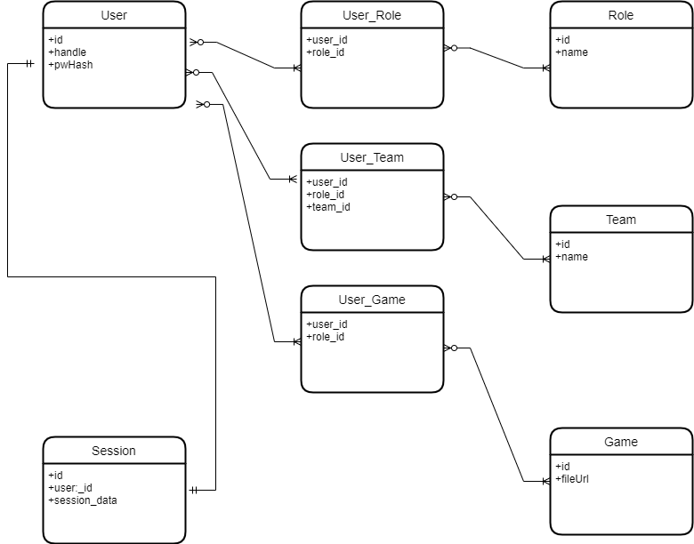
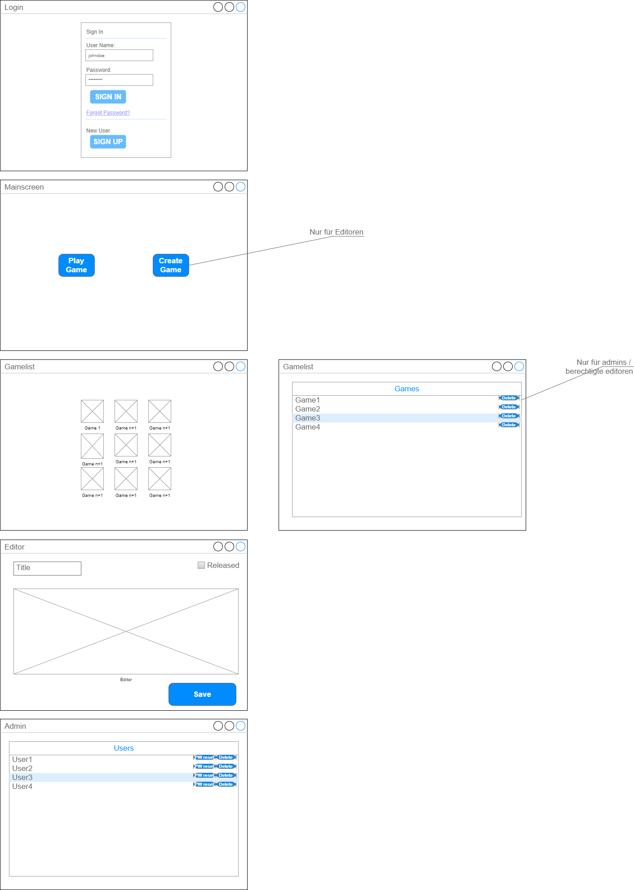

# Projektvorschlag Ivo Valls

Für das Abschluss Projekt schlage ich folgendes vor: 

## Arbeitstitel

EduAdventure

## Projektbeschreibung

Bie dem Projekt handelt es sich um eine Plattform für Textbasierte Adventures für nicht formelles lernen. Über dies Plattform sollen Menschen spielerisch an neue Inhalte in verschiedenen Themengebiete an neue Inhalte herangeführt werden.
Die Plattform bietet zum einen die Möglichkeit Spiele  zu entwerfen, sie zu spielen und zu bewerten. Falls es umsetzbar ist sollen die Spiele als Offline Anwendung exportiert werden können. 
Mit einem Spiel ist hier ein Textbasiertes Adventure gemeint, angelehnt an sogenannte Spielbücher. 
Anwender sollen vorgefertigte Spielbücher durchspielen können und evtl. Über ein Quiz gelerntes vertiefen können. 
Editoren sollen über einen Editor neue Spielbücher anlegen und editieren können. Mehrere Editoren können sich zu Teams zusammen schließen um gemeinschaftlich Inhalte entwickeln können.
Administratoren sollen aufgaben vornehmen können wie zum Beispiel Editoren freischalten, Sicherungen vornehmen.

## User Stories
### Nutzer

1) Als Nutzer möchte ich mir ein Benutzerkonto anlegen können
2) Als Nutzer möchte ich mich einloggen können
3) Als Nutzer möchte ich mein Benutzerkonto löschen können
4) Als Nutzer möchte ich eine Liste aller mir zur Verfügung stehenden Spiele sehen können
5) Als Nutzer möchte ich ein Spiel starten können
6) Als Nutzer möchte ich ein Spiel abschließen können
7) Als Nutzer möchte ich um eine Zulassung als Editor bitten können

### Editor

1) Als Editor möchte ich mich einloggen können
2) Als Editor möchte ich ein neues Spiel anlegen können
3) Als Editor möchte ich ein Spiel editieren können
4) Als Editor möchte ich ein Spiel veröffentlichen können
5) Als Editor möchte ich ein Spiel auf einen bestimmten Benutzerkreis beschränken können
6) Als Editor möchte ich ein Team gründen können
7) Als Editor möchte ich ein neues Mitglied einladen können
8) Als Editor möchte ich ein Mitglied aus einem Team in dem ich Admin bin entfernen können
9) Als Editor möchte ich ein Teammitglied zum Admin machen können

### Administrator

1) Als Administrator möchte ich einen User zum Editor machen können
2) Als Administrator möchte ich einen User zum Administrator machen können
3) Als Administrator möchte ich ein Spiel löschen können
4) Als Administrator möchte ich ein Nutzer Passwort zurück setzen können
5) Als Administrator möchte ich eine Datensicherung vornehmen können

## Datenmodell

## Wireframes

